# stl-models

STL models for OpenGL which I collected across the web.

- Files without links was taken directly from Blender.

## 1. Useful resources

- [NASA 3D Models](https://nasa3d.arc.nasa.gov/models).

## 2. Collected models

## `plane.stl` (ASCII)

### [`arch.stl`](https://raw.githubusercontent.com/jannerm/o2p2/refs/heads/master/assets/stl/arch.stl) (Binary)

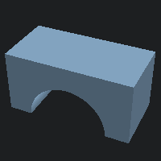

### [`cone-hires.stl`](https://raw.githubusercontent.com/jannerm/o2p2/refs/heads/master/assets/stl/cone-hires.stl) (Binary)

### `cone.stl` (ASCII)

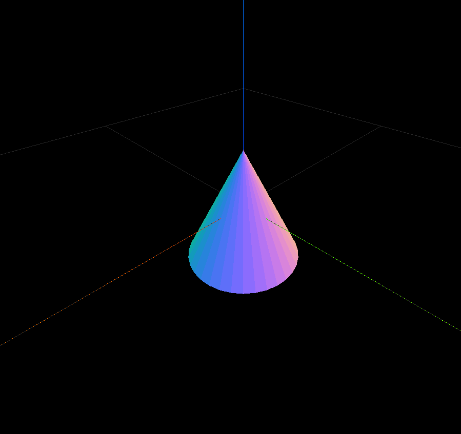

### `cube.stl` (ASCII)

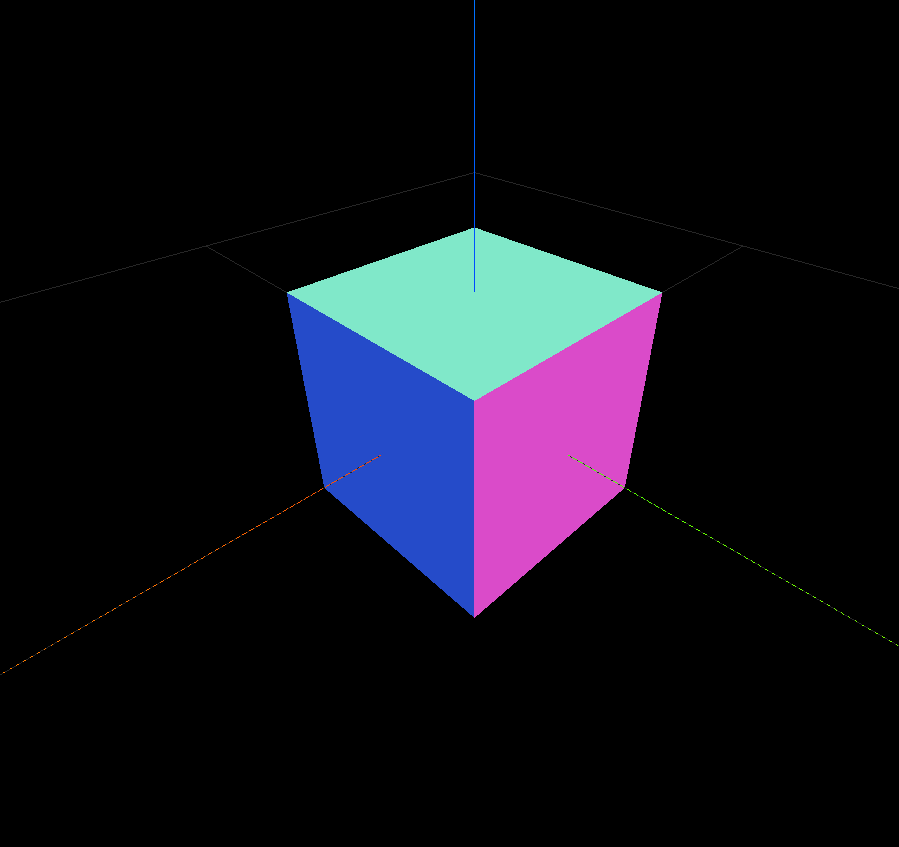

### `cylinder.stl` (ASCII)

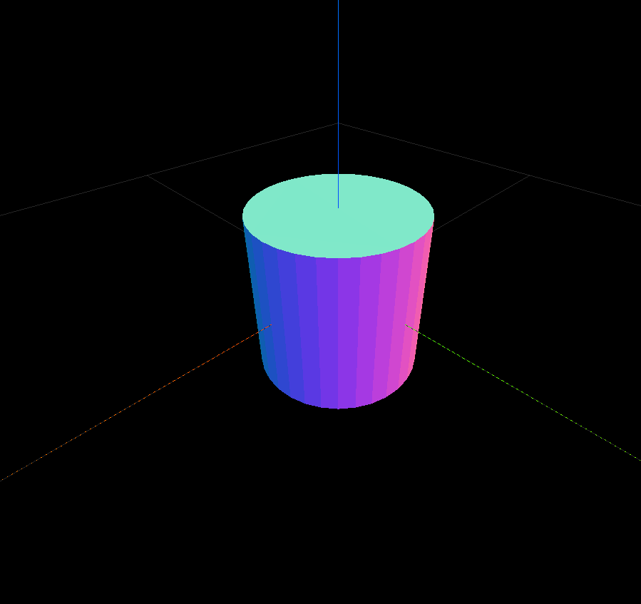

### [`dome.stl`](https://raw.githubusercontent.com/jannerm/o2p2/refs/heads/master/assets/stl/dome.stl) (Binary)

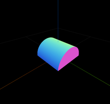

### [`half_rectangle.stl`](https://raw.githubusercontent.com/jannerm/o2p2/refs/heads/master/assets/stl/half_rectangle.stl) (Binary)

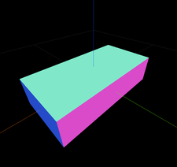

### [`hat.stl`](https://raw.githubusercontent.com/jannerm/o2p2/refs/heads/master/assets/stl/hat.stl) (Binary)

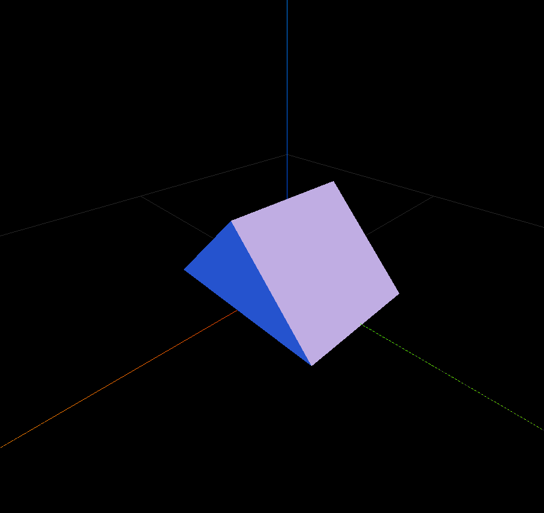

### [`horizontal_rectangle.stl`](https://raw.githubusercontent.com/jannerm/o2p2/refs/heads/master/assets/stl/horizontal_rectangle.stl) (Binary)

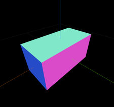

### [`middle_triangle.stl`](https://raw.githubusercontent.com/jannerm/o2p2/refs/heads/master/assets/stl/middle_triangle.stl) (Binary)

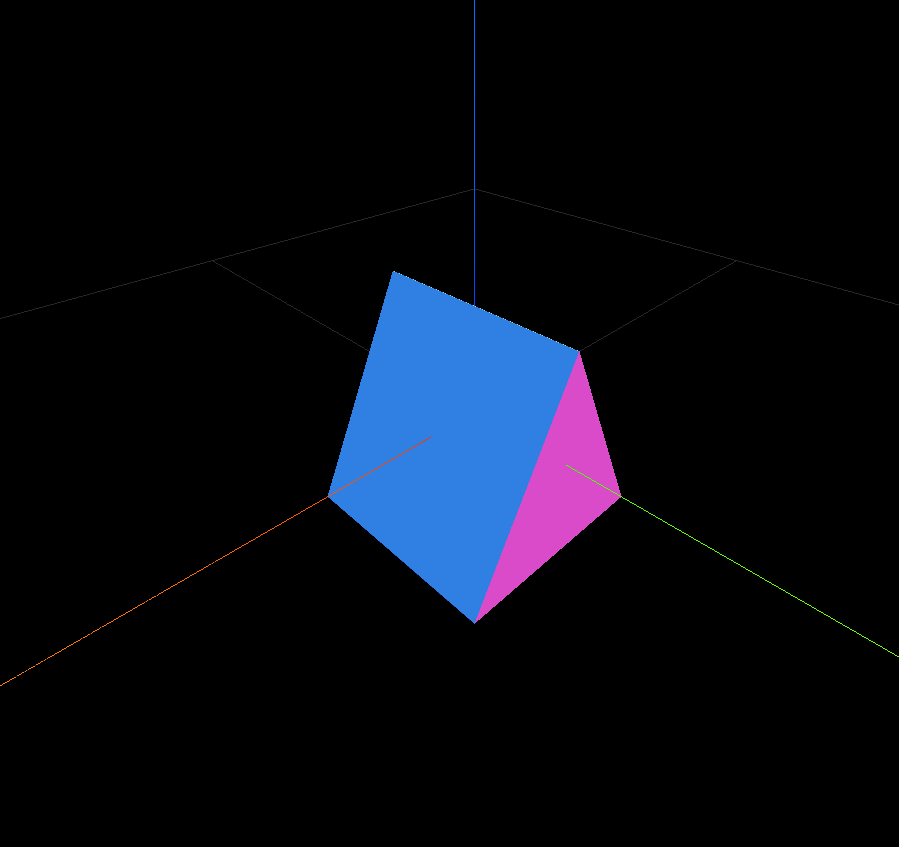

### [`rectangle.stl`](https://raw.githubusercontent.com/jannerm/o2p2/refs/heads/master/assets/stl/rectangle.stl) (Binary)

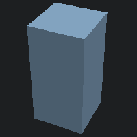

### [`sphere_hires.stl`](https://plmlab.math.cnrs.fr/gris/implicitmodules/-/raw/master/data/sphere.stl) (ASCII)

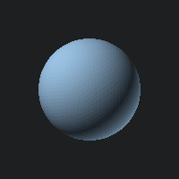

### `sphere.stl` (ASCII)

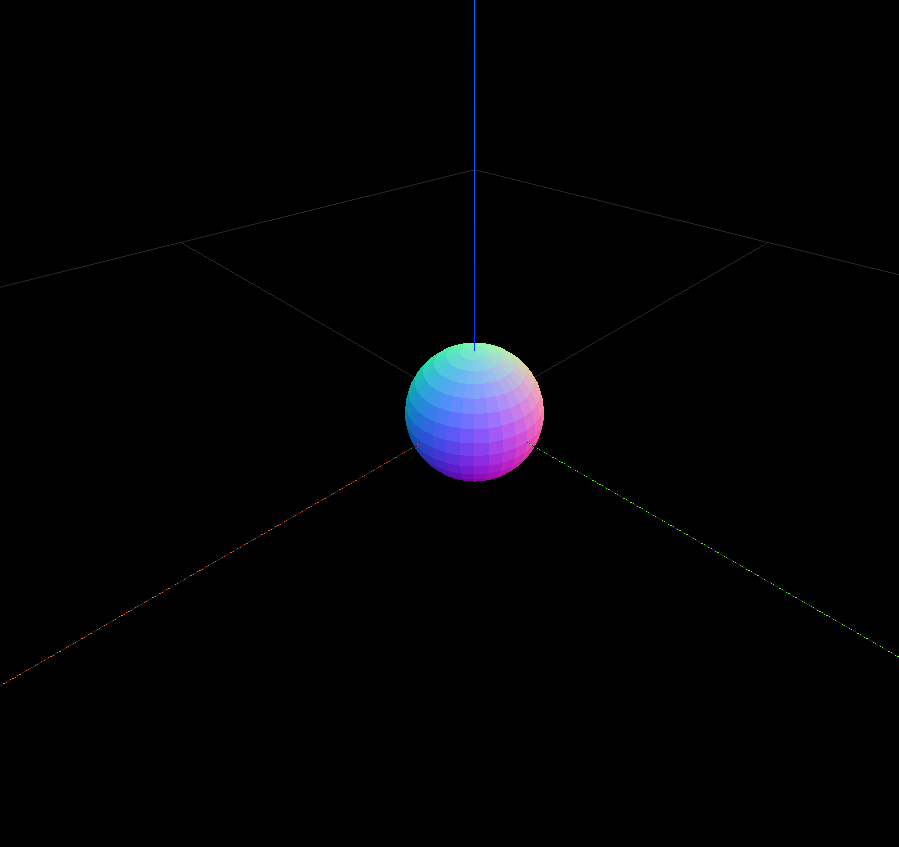

### [`tall_triangle.stl`](https://raw.githubusercontent.com/jannerm/o2p2/refs/heads/master/assets/stl/tall_triangle.stl) (Binary)

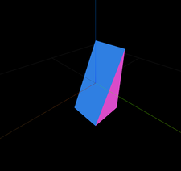

### [`teapot.stl`](https://users.cs.utah.edu/~dejohnso/models/teapot.stl) (ASCII)

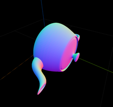

### [`tetrahedron_flat_top.stl`](https://raw.githubusercontent.com/jannerm/o2p2/refs/heads/master/assets/stl/tetrahedron.stl) (Binary)

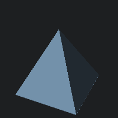

### [`tetrahedron.stl`](https://www.printables.com/model/263702-tetrahedron-openscad/files) (Binary)

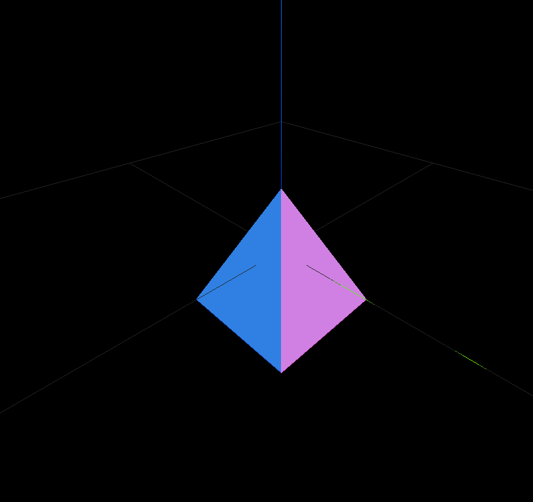

### [`triangle.stl`](https://raw.githubusercontent.com/jannerm/o2p2/refs/heads/master/assets/stl/triangle.stl) (Binary)

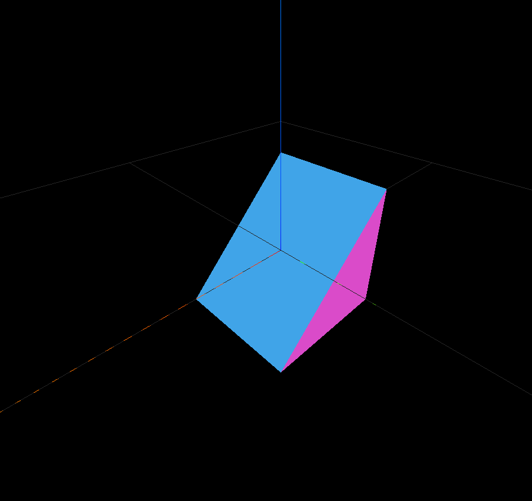

## `icosphere.stl` (ASCII)

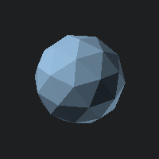

## `monkey.stl` (ASCII)

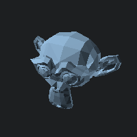

## `torus.stl` (ASCII)

### [`70-meter-dish.stl`](https://nasa3d.arc.nasa.gov/detail/70-meter-dish) (ASCII)

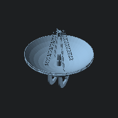
