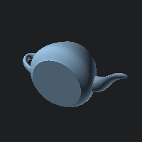

# 3d-models

## 1. Description

3D-models which I collected across the web or from Blender for my OpenGL study.

I saved same models in different formats:

- `.stl`: The most simple, but does not support textures;
- `.fbx`: Support textures;
- `.gltf`: Support textures, most advanced;

Below are previews for STL models. Some of them are in ASCII format, some not. I used ASCII when exporting from Blender. Files without links was taken directly from Blender.

I also add more segments for some primitives when exporting from Blender. For example, `sphere_2res.stl` contains 2 times more segments than `sphere.stl`. STL and GLTF formats are larger than FBX, so I don't store `8res` and `16res` for them.

## 2. Collected models

### `plane.stl` (ASCII)

### `circle.stl` (ASCII)

### `circle_2res.stl` (ASCII)

### `circle_4res.stl` (ASCII)

### [`arch.stl`](https://raw.githubusercontent.com/jannerm/o2p2/refs/heads/master/assets/stl/arch.stl) (Binary)

### `cone.stl` (ASCII)

### `cone_2res.stl` (ASCII)

### `cone_4res.stl` (ASCII)

### `cube.stl` (ASCII)

### `cylinder.stl` (ASCII)

### `cylinder_2res.stl` (ASCII)

### `cylinder_4res.stl` (ASCII)

### [`dome.stl`](https://raw.githubusercontent.com/jannerm/o2p2/refs/heads/master/assets/stl/dome.stl) (Binary)

### [`half_rectangle.stl`](https://raw.githubusercontent.com/jannerm/o2p2/refs/heads/master/assets/stl/half_rectangle.stl) (Binary)

### [`hat.stl`](https://raw.githubusercontent.com/jannerm/o2p2/refs/heads/master/assets/stl/hat.stl) (Binary)

### [`horizontal_rectangle.stl`](https://raw.githubusercontent.com/jannerm/o2p2/refs/heads/master/assets/stl/horizontal_rectangle.stl) (Binary)

### [`middle_triangle.stl`](https://raw.githubusercontent.com/jannerm/o2p2/refs/heads/master/assets/stl/middle_triangle.stl) (Binary)

### [`rectangle.stl`](https://raw.githubusercontent.com/jannerm/o2p2/refs/heads/master/assets/stl/rectangle.stl) (Binary)

### `sphere_uv.stl` (ASCII)

### `sphere_uv_2res.stl` (ASCII)

### `sphere_uv_4res.stl` (ASCII)

### `sphere_ico.stl` (ASCII)

### `sphere_ico_2res.stl` (ASCII)

### `sphere_ico_4res.stl` (ASCII)

### [`tall_triangle.stl`](https://raw.githubusercontent.com/jannerm/o2p2/refs/heads/master/assets/stl/tall_triangle.stl) (Binary)

### [`teapot.stl`](https://users.cs.utah.edu/~dejohnso/models/teapot.stl) (ASCII)

### [`tetrahedron_flat_top.stl`](https://raw.githubusercontent.com/jannerm/o2p2/refs/heads/master/assets/stl/tetrahedron.stl) (Binary)

### [`tetrahedron.stl`](https://www.printables.com/model/263702-tetrahedron-openscad/files) (Binary)

### [`triangle.stl`](https://raw.githubusercontent.com/jannerm/o2p2/refs/heads/master/assets/stl/triangle.stl) (Binary)

### `monkey.stl` (ASCII)

### `torus.stl` (ASCII)

### `torus_2res.stl` (ASCII)

### `torus_4res.stl` (ASCII)

### [`70-meter-dish.stl`](https://nasa3d.arc.nasa.gov/detail/70-meter-dish) (ASCII)

### [`octahedron.stl`](https://github.com/Nehri/slicing_algorithm/blob/master/octahedron.stl) (ASCII)

### [`dodecahedron.stl`](https://github.com/Nehri/slicing_algorithm/blob/master/dodecahedron.stl) (ASCII)

## 3. Useful resources

- [NASA 3D Models](https://nasa3d.arc.nasa.gov/models).
